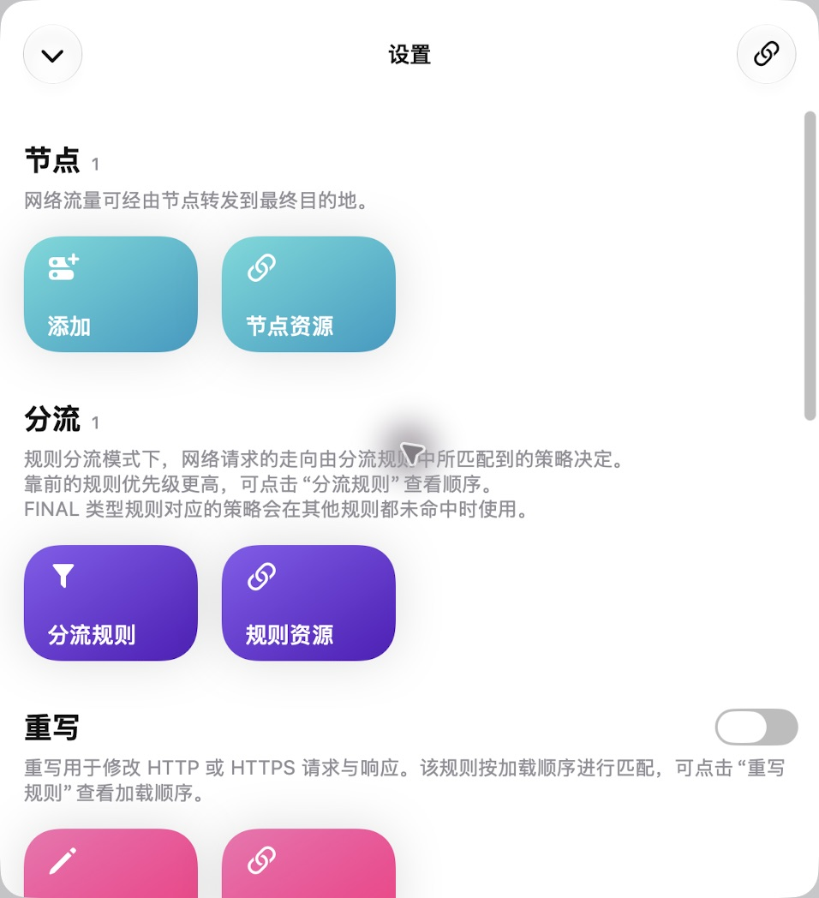
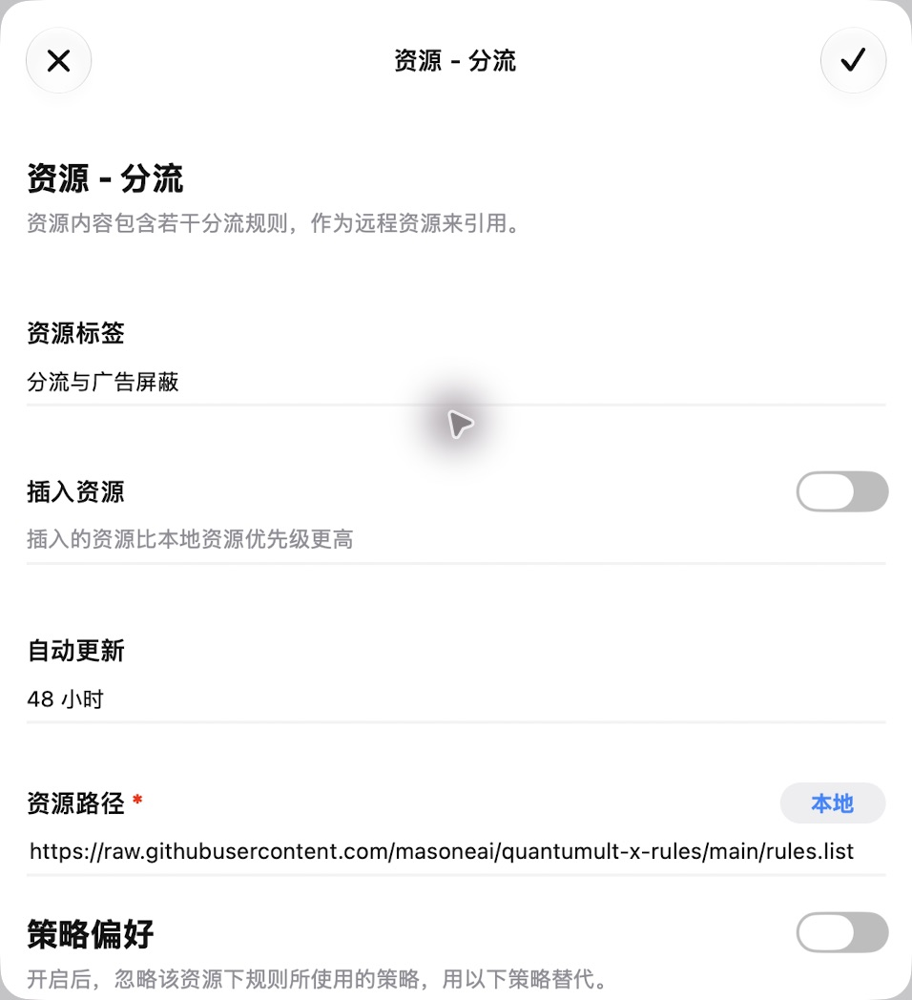
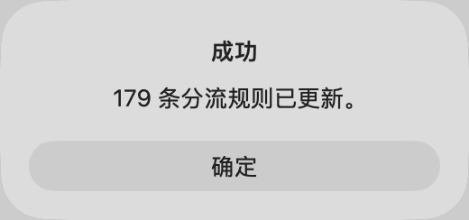
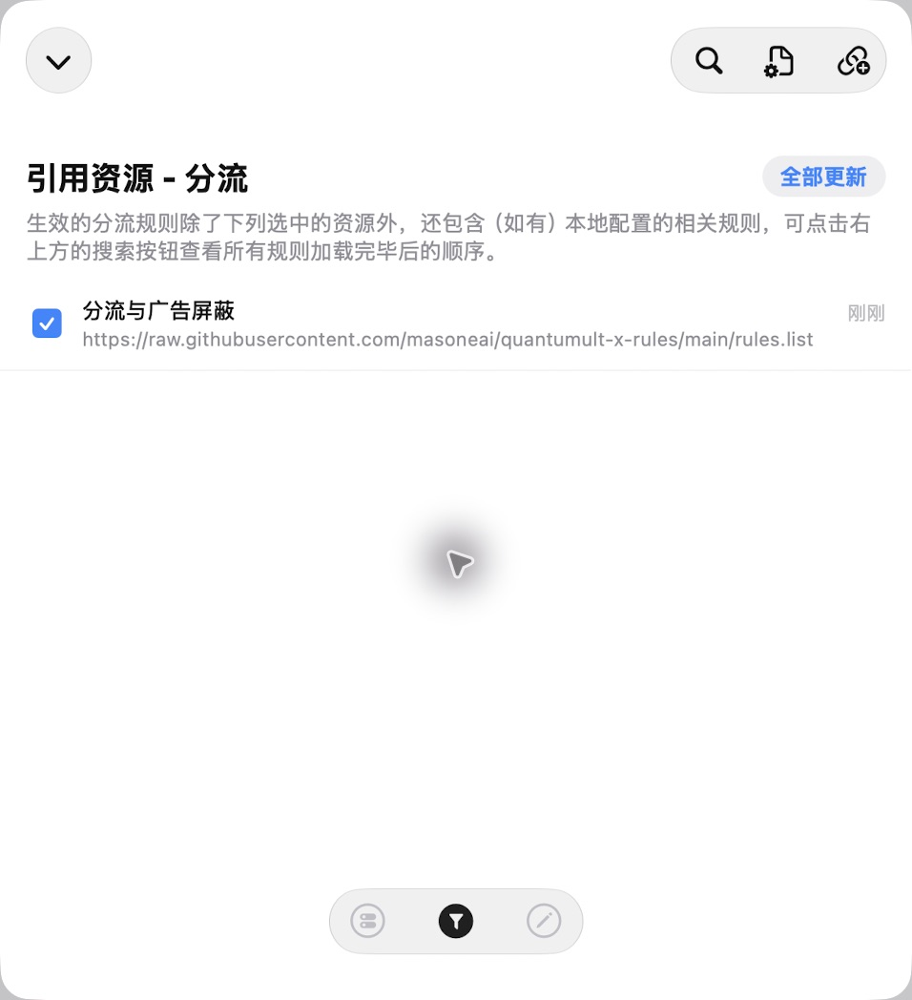

# 在圈 X 界面添加分流与广告订阅

本指南使用圈 X 的“规则资源”界面添加公开订阅。列表包含 179 条规则：50 条基础广告屏蔽和 129 条分流。节点和 DNS 需要在主配置中单独准备；这条公开规则链接不包含节点凭据。

## 1. 打开分流规则资源

进入“设置”，在“分流”下面点击“规则资源”，再点击右上角的添加链接按钮。请进入分流的资源页面。



截图中的“分流 1”是添加前主配置保留的一条最终兜底。已有完整本地规则的用户，应先备份配置，移除同一套本地重复规则，保留自己的例外和主配置最终兜底，避免它们提前命中而遮蔽远程更新。

## 2. 填入公开链接并保存

资源标签填写“分流与广告屏蔽”；资源路径只填写下方 URL：

```text
https://raw.githubusercontent.com/masoneai/quantumult-x-rules/main/rules.list
```

“插入资源”关闭，“策略偏好”关闭，“资源解析器”关闭。本次保留界面默认的“48 小时”自动更新。点击右上角的勾保存。



“策略偏好”开启会覆盖规则原本的直连、代理和拒绝策略，所以此列表应保留原策略。界面添加时不要将 `, tag=… , enabled=true` 粘贴到资源路径框。

主配置需要存在“节点选择”策略，其节点名称应与自己的节点一致，例如：

```ini
[policy]
static = 节点选择, 你的节点名称

[filter_local]
final, 节点选择
```

## 3. 确认下载成功

圈 X 显示“成功 179 条分流规则已更新”即表示资源下载完成。这个提示验证了规则加载，不代表广告拦截或网络连接已经实测。



## 4. 确认资源启用

在“引用资源 - 分流”列表中，检查公开 URL 对应的“分流与广告屏蔽”资源处于选中状态。后续可点击“全部更新”手动刷新。



返回主界面后使用“分流”运行模式。连接开启后，经过圈 X 的流量才会应用这些规则。列表已包含广告规则，无需再重复添加 `ads.list`。域名屏蔽不保证去除与正常视频共用域名的 YouTube 视频内广告或信息流内嵌广告。

## 截图范围

以上图片来自实际操作，只展示公开规则地址、选项和加载结果。画面及图片元数据均已检查；未包含私人订阅令牌、UUID、连接路径、个人 IP、Wi-Fi 名称、账户或访问记录。未拍摄私人主配置、节点资源详情、下载历史和网络活动页面。
